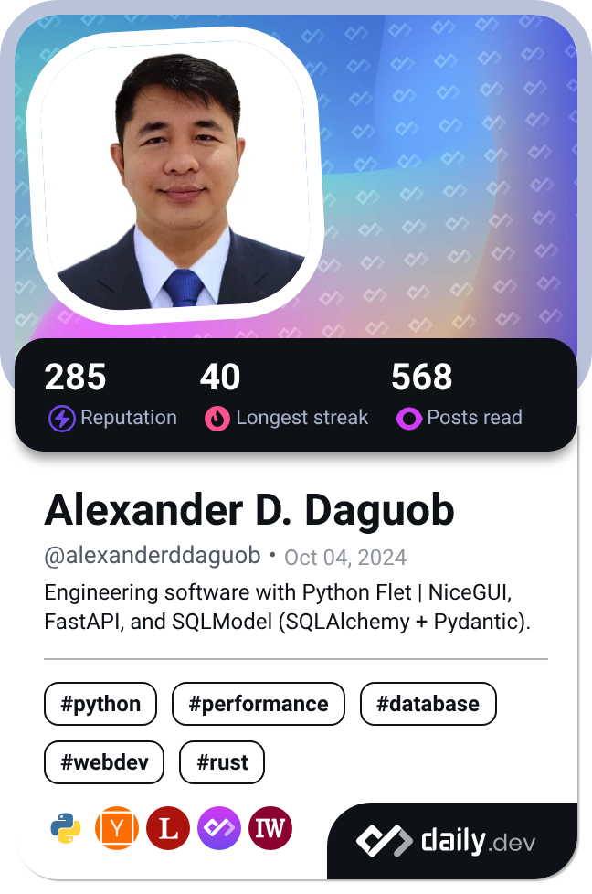

    <!-- Text content column -->
    

        <ul>    
            <li> 👋😄 Hi, I'm Alexander!</li>
            <li> 👀 I recently enjoy engineering and developing programs in <a href="https://www.python.org/">Python</a> and under its umbrella: <a href="https://flet.dev/docs/">Flet</a>, <a href="https://docs.python.org/3/library/sqlite3.html">SQLite3</a> and <a href="https://fastapi.tiangolo.com/">FastAPI</a>.</li>
            <li> 🌱 Prior to my Software Engineering works: 
            <mark>BS Computer Engineering - 2010</mark> - AMA Computer College - Bacolod, Philippines. 
            <mark>AB Philosophy - 2013</mark> - Sacred Heart Seminary - Bacolod, Philippines. 
            <mark>BS Sacred Theology - 2016</mark> - University of Santo Tomas - Manila, Philippines. 
            <mark>MA/STL Sacred Theology - 2017-2022</mark> - University of Santo Tomas - Manila, Philippines. 
            <li> 📚 I am forever thankful to Harvard University's CS50 courses:
                <ul>
                    <li><a href="https://cs50.harvard.edu/x">CS50x</a>: Computer Science with C, C Data Structures and Algorithms, Python, SQL, Web, Flask, Cybersecurity, </li>
                    <li><a href="http://cs50.harvard.edu/python">CS50Python</a>: Computer programming, debugging and testing with Python, </li>
                    <li><a href="https://cs50.harvard.edu/sql">CS50SQL</a>: Database administration with SQL, including data modeling, normalization, and advanced querying techniques.</li>
                    <li><a href="http://cs50.harvard.edu/web">CS50Web</a>: HTML, CSS, JavaScript, Django, Git, CI/CD, Scalability and Security.</li>
                </ul>
            </li>
            <li> 📫 <b>Email:</b> alexanderdaguob@gmail.com</li>
            <li> 👥 <b>Community:</b> 
                <ul>
                    <li>Harvard's CS50: <a href="https://discord.gg/cs50">Discord</a></li>
                    <li>Flet: <a href="https://discord.com/invite/dzWXP8SHG8">Discord</a></li>
                    <li>Python: <a href="https://discord.gg/python">Discord</a></li>
                </ul>
            </li>
            <li> <h4>⛔ <b>Availability:</b> currently occupied with projects in my private repositories.</h2></li>
        </ul> 
    

    <!-- Dev Card column -->
    

        
    

<!---
addaguob/addaguob is a ✨ special ✨ repository because its `README.md` (this file) appears on your GitHub profile.
You can click the Preview link to take a look at your changes.
--->
