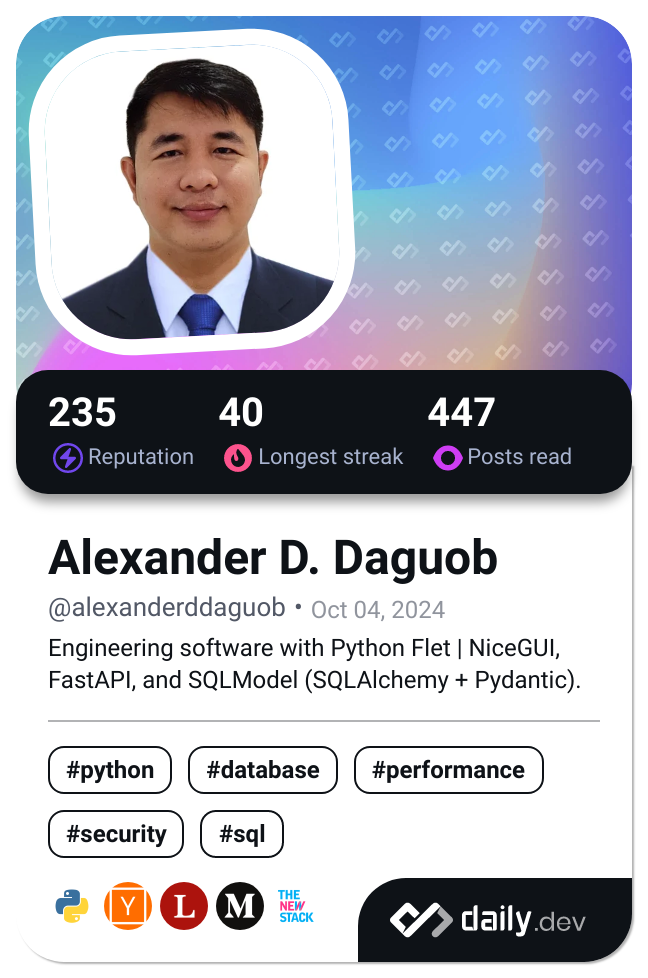

<div style="display: flex; align-items: flex-start; justify-content: space-between; gap: 20px;">

<div style="flex: 1;">

```python
class AlexanderDaguob:
    name: str = "Alexander D. Daguob"
    role: str = "Software Engineer — Full‑Stack Python"
    location: str = "Quezon City, Metro Manila"
    email: str = "alexanderdaguob@gmail.com"
    phone: str = "+63 929 773 1916"
    since: str = "Aug 2023–Present"

    @staticmethod
    def summary() -> str:
        return (
            "Independent engineer shipping end‑to‑end apps with FastAPI, SQLModel, "
            "and Flet/NiceGUI. Built PUSH App (Champion) and EyeQsoft prototype. "
            "Language‑agnostic and quick to learn any stack required by the team."
        )

    @staticmethod
    def stack() -> dict:
        return {
            "backend": ["Python 3", "FastAPI", "SQLModel", "SQLAlchemy", "Auth", "Async"],
            "ui": ["Flet", "NiceGUI", "HTML/CSS/JS"],
            "data": ["SQLite", "PostgreSQL", "Pandas"],
            "devops": ["Git", "CI/CD", "Docker (basic)"]
        }

    @staticmethod
    def projects() -> list:
        return [
            {
                "name": "PUSH App",
                "role": "solo dev",
                "notes": "nursing research platform — 1st‑place (Champion); FastAPI + SQLModel + Flet; reporting/exports"
            },
            {
                "name": "EyeQsoft",
                "role": "independent",
                "notes": "clinic ops prototype; components reused across newer projects"
            },
            {
                "name": "Open‑source utilities",
                "notes": "CLI/GUI tools, scraping & ETL; consistent commits since Aug 2023"
            }
        ]

    @staticmethod
    def education() -> list:
        return [
            "Harvard CS50x & CS50P (2023–2024)",
            "BS Computer Engineering — AMA (2004–2010)"
        ]

    @staticmethod
    def links() -> dict:
        return {
            "GitHub": "https://github.com/addaguob",
            "LinkedIn": "https://linkedin.com/in/addaguob",
            "Email": "mailto:alexanderdaguob@gmail.com"
        }


if __name__ == "__main__":
    me = AlexanderDaguob()
    print(me.summary())
```

</div>

<div style="flex-shrink: 0;">
  <a href="https://app.daily.dev/alexanderddaguob">
    
  </a>
</div>

</div>

<!---
addaguob/addaguob is a ✨ special ✨ repository because its `README.md` (this file) appears on your GitHub profile.
You can click the Preview link to take a look at your changes.
--->
